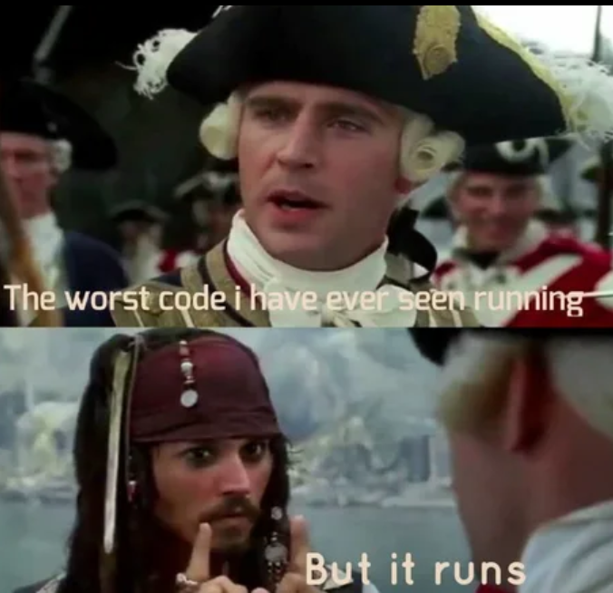

# Szakdolgozat: Portal 2D
> hatarido : majus 15 (eddigre kell bekotve leadni)

## jelenlegi demo:
[Demo](src)

<small>
Utolsó módosítás:
&nbsp;
</small>

## milestones
  * fizikai szimulacio, labdak es falak kozt
  * portalok falra
  * portalok portalkodjanak
  * server vegezze a fizikai szimulaciot
  * ket szemely eggyszerre jatszhasson

## Az eredeti temabejelento
  Szakdolgozatom témája egy a Portal című játékhoz hasonló 2 dimenziós többszemélyes játék megvalósítása asztali vagy webes
alkalmazásként. A játék fő eleme, hogy a pályák során különböző fejtörőket kell megoldani, amiben egy teleportációt megvalósító
eszköz (portal gun) lesz a játékosok segítségére, amivel két sík felületre portálokat helyezhetnek el. A játék fizikai rendszere szerint
amilyen lendülettel áthalad egy tárgy vagy a játékos az egyik portálon, az olyan lendülettel távozik a másikon, ez fontos szerepet fog
játszani az egyes feladatok megoldásánál. A játék fizikai rendszerét magam valósítanám meg, ezzel egy egyedi fizikai szimulációt
létrehozva. Az alkalmazást javascript vagy python nyelvekben szeretném megvalósítani, a többszemélyességet pedig tcp alapú web
socketek segítségével. Többszemélyesség a játékban oly módon fog megnyilványulni, hogy mindkét játékosnak lesz egy-egy portalgun ja és egymást segítve kell a fejtörőket megoldaniuk

### Eddig

- fps független fizikai szimuláció
- labda labda ütközés
- labda négyzet alakú fallal való ütközése
- labda téglalap alakú fallal való ütközése
- labda lekerekített téglalap alakú fallal való ütközése
- 2 falra helyezhető portál
- Portalok úgy viselkednek mint az eredeti játékban
- websocket alapú többszeméyles mód
- csatlakozás szerverre